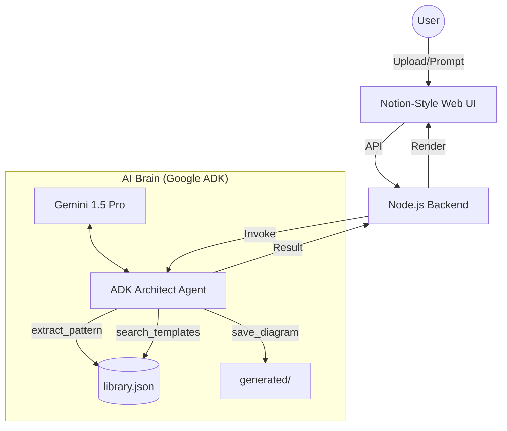

# Draw.io AI Architect 🤖📐

> **An Autonomous Agent that "learns" your design patterns and builds expert system diagrams.**

## 🎯 Project Vision
This isn't just an LLM guessing XML. This is a **Pattern-Aware Architect** that:
1.  **Distills Design Style**: Analyzes your existing `.drawio` files to extract specific enterprise styles (e.g., "Our servers are green cubes with 120x80 dimensions").
2.  **Autonomous Construction**: Uses the Google Agent Development Kit (ADK) to search for styles, build valid XML, and manage its own file persistence.
3.  **Premium Visualization**: Features a **Notion-style Dark Mode** viewer using D3.js for immediate, high-fidelity diagram verification.

## 🏗️ Architecture
The system follows a **Hybrid Loop** combining a Node.js Express server with a Python ADK agent.



### Key Components
- **The Agent (`adk_agent_demo.py`)**: A tool-using agent that handles extraction, style lookup, and diagram generation.
- **Notion Viewer (`public/index.html`)**: A sleek dark-themed D3.js viewer with orthogonal routing and auto-zoom.
- **Knowledge Base (`library.json`)**: A persistent store of your design tokens and patterns.

## 🚀 Capabilities

### 1. Style Extraction (Learning)
Ask the agent to "learn" from a file. It will analyze the XML, find relevant components, and save their styles and geometry to the library.
- *Prompt:* "Extract the 'Web Server' style from `sample/web_architecture.drawio` as 'enterprise server'"

### 2. Autonomous Generation
The agent doesn't just output text; it uses its tools to find the right styles and generate valid Draw.io XML that adheres to your learned patterns.
- *Prompt:* "Design a HA Kubernetes cluster and save it as 'k8s_design.drawio'"

### 3. Professional Visualization
Instant rendering of complex Draw.io files with:
- **Orthogonal Edge Routing**: Clean, non-crossing lines.
- **Auto-Scale & Fit**: Diagrams are perfectly centered and zoomed.
- **Notion Dark Theme**: Beautiful, minimal aesthetic for enterprise architects.

## 📂 Getting Started

### Prerequisites
- Python 3.9+ (Recommended: `uv`)
- Google Gemini API Key (Set in `.env` as `GOOGLE_API_KEY`)

### Setup
Using `uv` (recommended):
```bash
uv sync
```
Or with standard pip:
```bash
pip install google-adk google-generative-ai
```

## 🧪 Test Scenarios & Usage

You can interact with the agent directly via the CLI using `adk_agent_demo.py`. This is the best way to verify the library extraction and generation logic.

### 1. Batch Extraction (Learning)
Verify that the agent can "ingest" multiple design patterns from a single file.
```bash
python adk_agent_demo.py "learn all patterns from sample/k8s_architecture.drawio"
```
**Expected Result:** The agent will report extracting multiple patterns (e.g., 'k8s pod', 'k8s node') and `library.json` will be updated.

### 2. Targeted Component Search
Check if the agent correctly identifies existing styles before building.
```bash
python adk_agent_demo.py "Do we have a 'pod' style in our library? If so, show me the details."
```
**Expected Result:** The agent should call `search_templates('pod')` and return the JSON style/geometry.

### 3. End-to-End Generation
Request a complex diagram that uses the learned patterns.
```bash
python adk_agent_demo.py "Design a 3-tier web app with a load balancer, 2 servers, and a database and save it as web_app.drawio"
```
**Expected Result:** The agent will generate XML using styles from `library.json` and save it to the `generated/` folder.

### 4. Logic Verification (Dedicated Script)
For a quick sanity check of the tool logic without LLM latency:
```bash
python test_tools.py
```

---
*Developed with the assistance of Antigravity Agent.*
