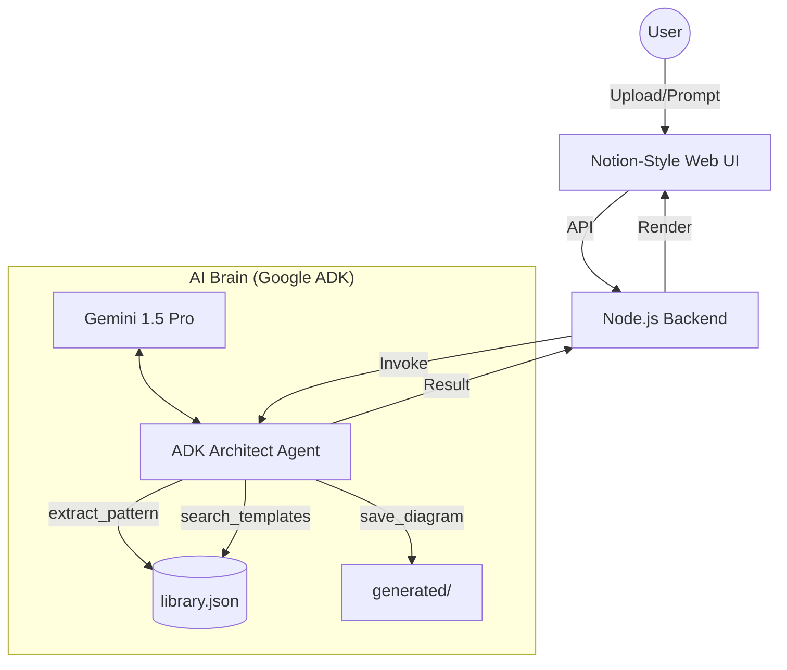

# Draw.io AI Architect 🤖📐

> **An Autonomous Agent that "learns" your design patterns and builds expert system diagrams.**

## 🎯 Project Vision
This isn't just an LLM guessing XML. This is a **Pattern-Aware Architect** that:
1.  **Distills Design Style**: Analyzes your existing `.drawio` files to extract specific enterprise styles (e.g., "Our servers are green cubes with 120x80 dimensions").
2.  **Autonomous Construction**: Uses the Google Agent Development Kit (ADK) to search for styles, build valid XML, and manage its own file persistence.
3.  **Premium Visualization**: Features a **Notion-style Dark Mode** viewer using D3.js for immediate, high-fidelity diagram verification.

## 🏗️ Architecture
The system follows a **Hybrid Loop** combining a Node.js Express server with a Python ADK agent.



### Key Components
- **The Agent (`adk_agent_demo.py`)**: A tool-using agent that handles extraction, style lookup, and diagram generation.
- **Notion Viewer (`public/index.html`)**: A sleek dark-themed D3.js viewer with orthogonal routing and auto-zoom.
- **Knowledge Base (`library.json`)**: A persistent store of your design tokens and patterns.

## 🚀 Capabilities

### 1. Style Extraction (Learning)
Ask the agent to "learn" from a file. It will analyze the XML, find relevant components, and save their styles and geometry to the library.
- *Prompt:* "Extract the 'Web Server' style from `sample/web_architecture.drawio` as 'enterprise server'"

### 2. Autonomous Generation
The agent doesn't just output text; it uses its tools to find the right styles and generate valid Draw.io XML that adheres to your learned patterns.
- *Prompt:* "Design a HA Kubernetes cluster and save it as 'k8s_design.drawio'"

### 3. Professional Visualization
Instant rendering of complex Draw.io files with:
- **Orthogonal Edge Routing**: Clean, non-crossing lines.
- **Auto-Scale & Fit**: Diagrams are perfectly centered and zoomed.
- **Notion Dark Theme**: Beautiful, minimal aesthetic for enterprise architects.

## 📂 Getting Started

### Prerequisites
- Node.js & npm
- Python 3.9+ (with `google-adk` if available)
- Google Gemini API Key

### Setup
```bash
npm install
pip install google-adk google-generative-ai
```

### Run
```bash
node src/server.js
# Access at http://localhost:3000
```

---
*Developed with the assistance of Antigravity Agent.*
